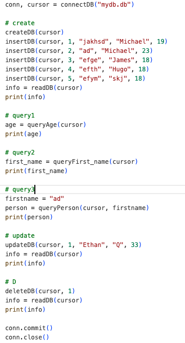
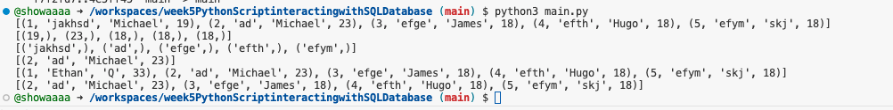

# week5PythonScriptinteractingwithSQLDatabase

## Description
Python script interacting with SQLlite database. This project was generated from python template, which includes Makefile, requirements.txt, githubAction. It can automatically install, test, format, lint my change. This project create a database table called person. It supports 3 query operations, updates, delete operations.

First, I create this table and insert 5 rows, then print out the result shown in first line of terminal.  

Then, I query people's age, firstname and the person whose firstname is "ad" shown in second, third, forth line of terminal.  

Next, I update the the first row to "Ethan", "Q", 33 shown in fifth line of terminal.  

Lastly, I delete the first row and print all the person in this database table. As you can see, there is no ethan anymore.  

## Sample Output

